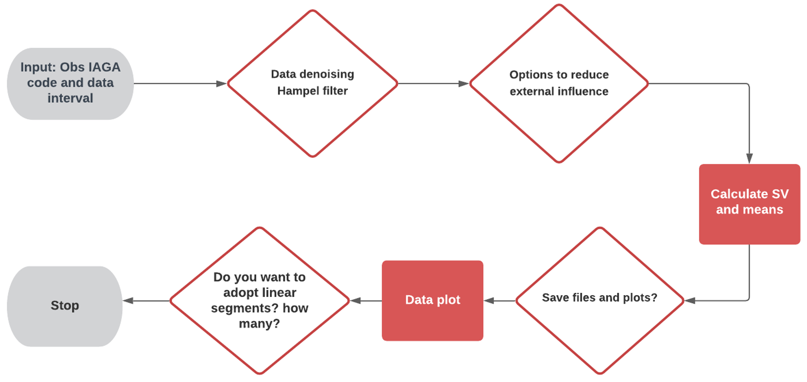

##  About Me
I'm a Marcos Vinicius Silva...


# Fast geomagnetic jerk detection 
My Thesis project in geomagnetism.

A python tool to study the secular variation of the geomagnetic field and accelerate the geomagnetic jerk detection.

Actually works for every INTERMAGNET geomagnetic observatory (definitive and quasi-definitive data).

There are functions to reduce the external field contribution, calculate the secular variation, detect geomagnetic jerks...

The library is separetade in modules called data processing tools, utility tools, support functions and main functions. 


## Import function suggestion

To use the developed funtions, is necessary to import them. I suggest to use the following statements to import the modules.

```bash
  from Thesis_Marcos import data_processing_tools as dpt
  from Thesis_Marcos import utilities_tools as utt
  from Thesis_Marcos import thesis_functions as mvs
  from Thesis_Marcos import support_functions as spf
```


## Load_INTERMAGNET_files

Function to read INTERMAGNET observatory files, works with minute mean IAGA2002 quasi-definitive and definitive files. 

```python

Load_INTERMAGNET_files(path = path to files,station = 'obs IAGA code',starttime = 'yyyy-mm-dd',endtime = 'yyyy-mm-dd')

```

## SV_OBS Usage

SV_OBS is the main funcion, allowing the user to process the geomagnetic data in a interactive workflow, using most of the available data_processing functions.



```python

SV_OBS(station = 'VSS', stattime = '2000-01-01, endtime = '2021-06-30', plot_chaos = True, convert_HDZ_to_XYZ = True)
```
