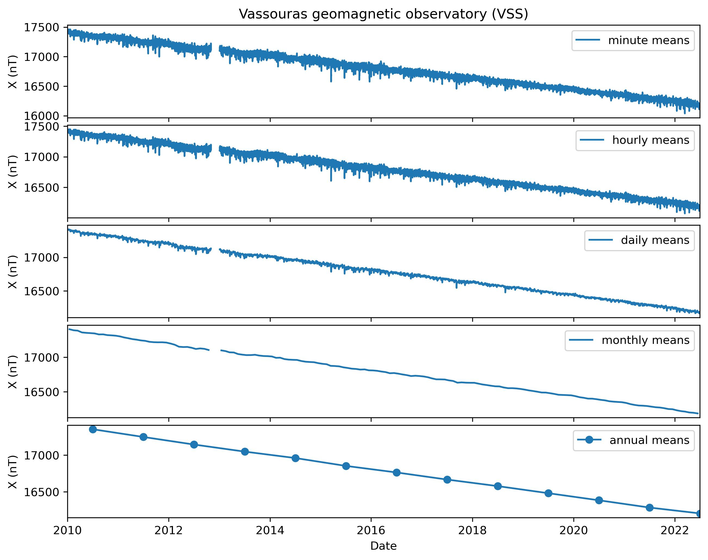
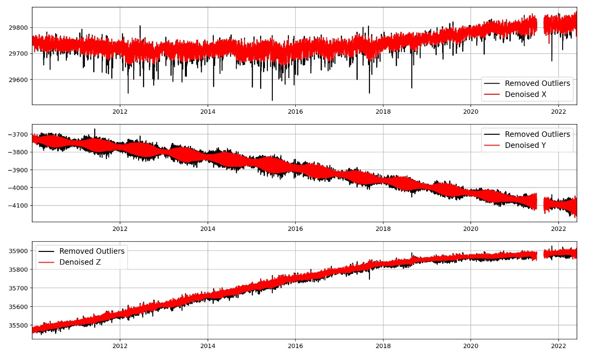
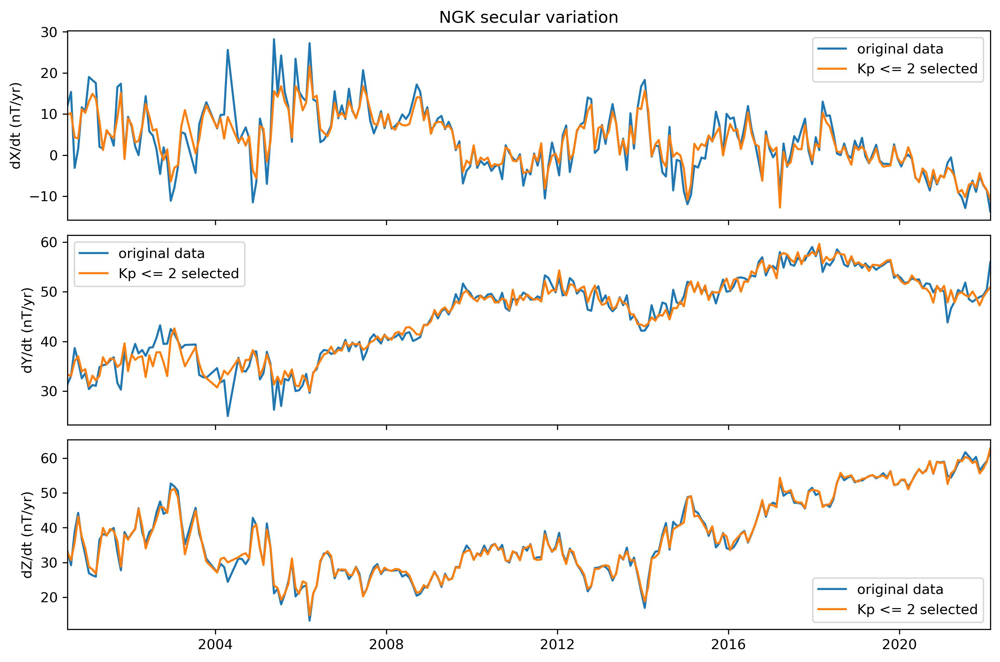
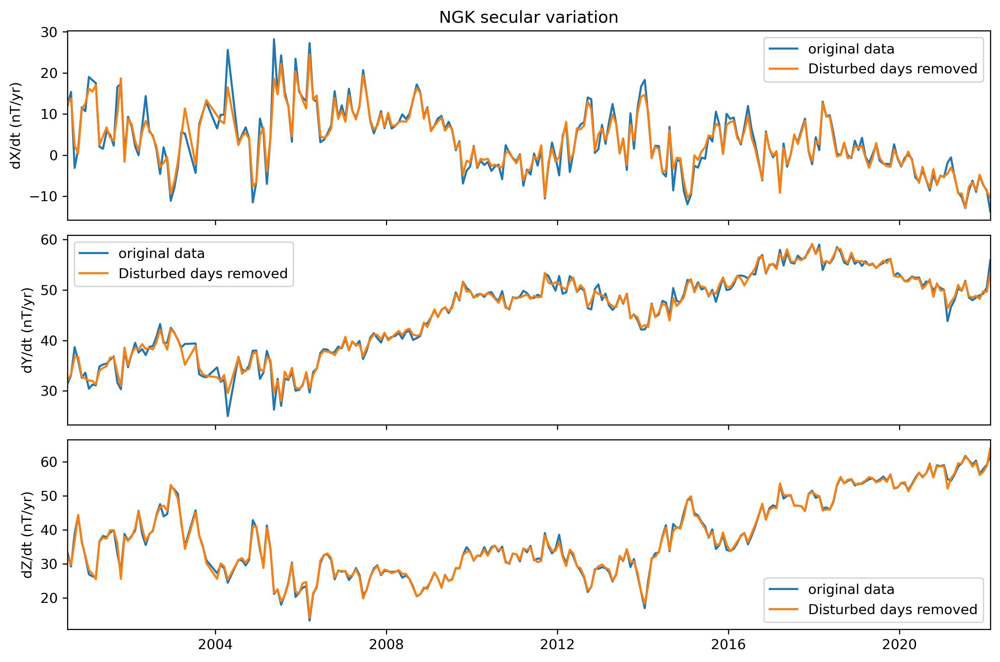
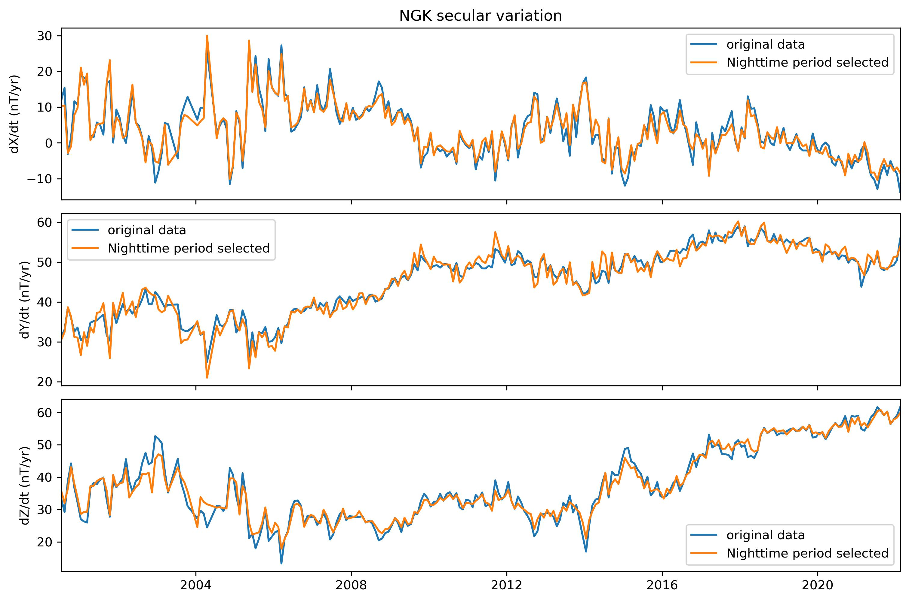
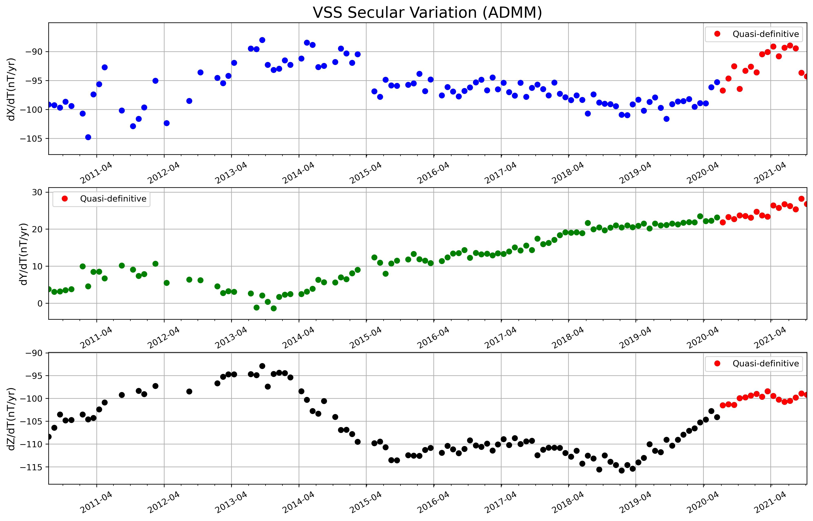
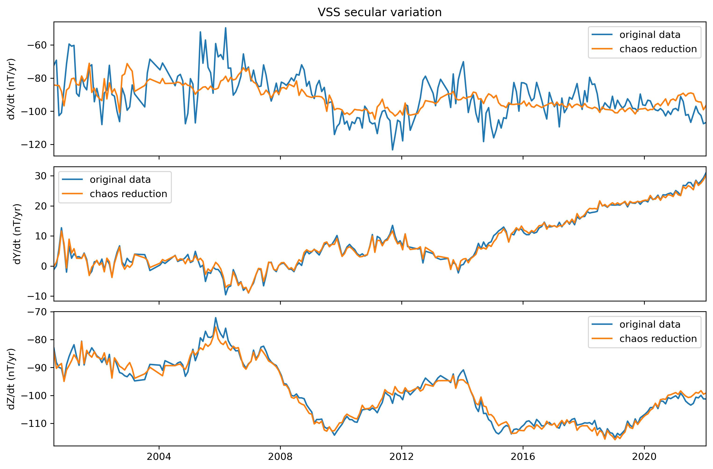
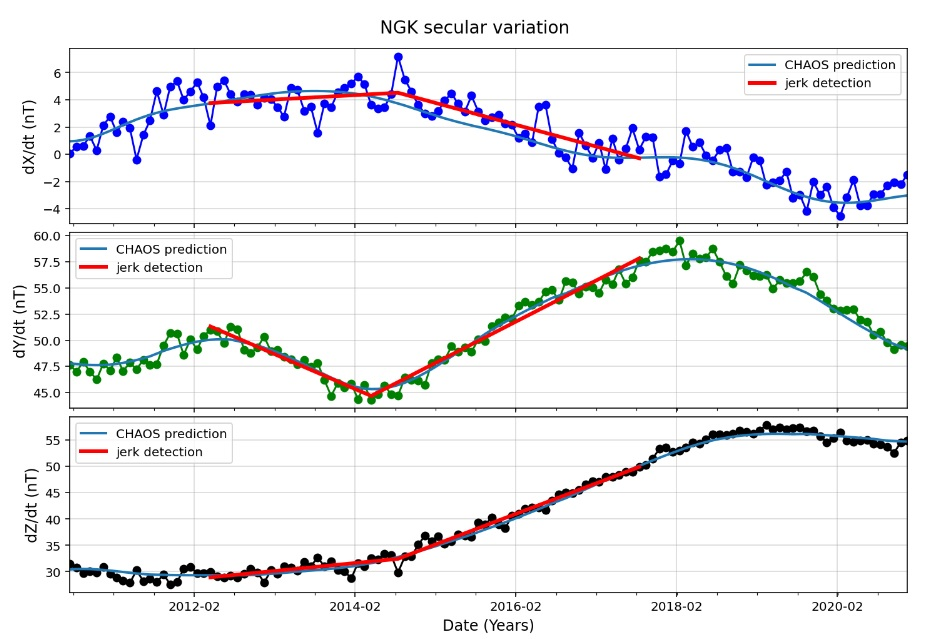
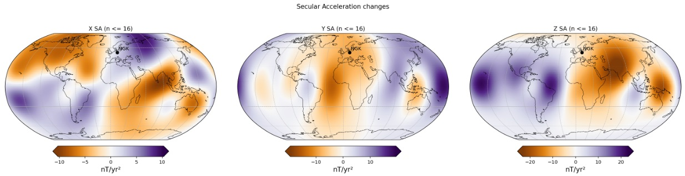

##  About Me
I'm a Marcos Vinicius Silva...


# Fast geomagnetic jerk detection 

My Master project in geomagnetism.

A python tool to study the secular variation of the geomagnetic field and accelerate the geomagnetic jerk detection.

Actually works for every INTERMAGNET geomagnetic observatory (definitive and quasi-definitive IAGA-2002 data).

There are functions to reduce the external field contribution, calculate the secular variation, detect geomagnetic jerks...

The package is separetade in modules called data_processing_tools, utility_tools, support_functions and main_functions. 

All the functions have a docstring with the inputs explanation and an usage example.


# Documentation summary

* [Setting up MOSFiT package](#Setting-up-MOSFiT-package)
  * [Package installation](#Package-installation)
  * [Downloading IAGA-2002 data](#Downloading-IAGA-2002-data) 
* [Package modules import suggestion](#Package-modules-import-suggestion)
* [Requirements](#Requirements)
* [Modules functions](#Modules-functions)
  * [main_functions](#main_functions)
  * [data_processing_tools](#data_processing_tools)
  * [utilities_tools](#utilities_tools)
 * [main_functions usage](#main_functions-usage) 
 * [data_processing_tools functions usage](#data_processing_tools-functions-usage)  

## Setting up MOSFiT package

The MOSFiT python package was built to work with INTERMAGNET minute mean data in the IAGA-2002 format, in order to analyse the SV and check INTERMAGNET Magnetic Observatory (IMO) data quality. The definitive and quasi-definitive data are mainly used because of higher quality and reliability, especially for SV studies. However, we can also apply MOSFiT to others types of IAGA-2002 data, i.e. provisional data).

### Package installation

MOSFiT is developed in the Python 3 language. The package can be compiled in the command window or in a “jupyter notebook enviroment”.

You can download MOSFiT in: https://github.com/marcosv9/Thesis-Marcos. In this same link, there is a documentation of how to use the package functions, with some examples.


### Downloading IAGA-2002 data

In order to use MOSFiT, it is necessary to have the data stored in a local computer.

This data can be downloaded from the INTERMAGNET website (https://www.intermagnet.org/), directly from the INTERMAGNET ftp server (ftp://ftp.seismo.nrcan.gc.ca/intermagnet/) or by using the MOSFiT function called “download INTERMAGNET file” (by choosing datatype, year, month and the list of observatories).

MOSFiT will only read filenames in the same format of INTERMAG-NET IAGA-2002 2. After the data is downloaded, the user may organize all files from different observatories in a single or multiple folders.

Most MOSFIT functions require an input called 'station'. It is the 3 letter IAGA code of the INTERMAGNET observatory. In MOSFiT there is a database with all INTERMAGNET observatories registered (IAGA code, latitude, longitude and altitude, this informations are used in many data processing functions). If you want to use MOSFiT with an observatory or location that are not registered in the database, there is a MOSFiT class called IMO that includes any location into the database. See utilities_tools section for an explanation about how to include any location.

## Package modules import suggestion

To use the developed funtions, is necessary to import them. I suggest to use the following statements to import the modules.

```bash
  import data_processing_tools as dpt
  import utilities_tools as utt
  import main_functions as mvs
  import support_functions as spf
```

## Requirements

* scipy
* chaosmagpy
* numpy
* pandas
* matplotlib
* glob2
* pathlib2
* pwlf
* chaosmagpy
* scikit-learn


## Modules functions

Here are the principal functions of each module and a quick description.

Functions listed here are fundamental in the geomagnetic data processing. 

There are others functions into the modules, including the support_functions module that was not mentioned. Most of them are internally used by the package.  

### main_functions

```python
  import main_functions as mvs
```

| Function | Description                |
| :-------- | :------------------------- |
| [mvs.load_intermagnet_files](#load_intermagnet_files)(station, starttime, endtime, files_path) | read and merge IAGA-2002 file format into a pandas DataFrame |
| [mvs.sv_obs](#sv_obs)(station, starttime, endtime, plot_chaos, files_path) | interactive data processing workflow ultil geomagnetic jerk detection|
| [mvs.plot_sample](#plot_samples)(station, dataframe, save_plots ...) | automatically plot hourly, daily, monthly and annual means|
| [mvs.plot_sv](#plot_sv)(station, starttime, endtime, df_station, df_chaos, ...) | automatically plot SV with options to correct the data and plot CHAOS prediction|
| [mvs.plot_tdep_map](#plot_tdep_map)(time, deriv, plot_changes, station) | plot a global map of the SV or SA as well as their changes (from CHAOS prediction)|


### data_processing_tools

```python
  import data_processing_tools as dpt
```
| Function | Description                |
| :-------- | :------------------------- |
| [dpt.resample_obs_data](#resample_obs_data)(dataframe, sample, apply_percentage) | Resample obs minute or hourly means into hourly, daily, monthly or annual means |
| [dpt.hampel_filter_denoising](#hampel_filter_denoising)(dataframe, window_size, n_sigmas, ...)| Denoising filter based on median absolute deviation|
| [dpt.night_time_selection](#night_time_selection)(station, dataframe)| Select the nighttime period from geomagnetic data. Default from 22pm to 2am LT.|
| [dpt.keep_quiet_days](#keep_quiet_days)(dataframe)| Select only top 10 quiet days from each month|
| [dpt.remove_disturbed_days](#remove_disturbed_days)(dataframe)| Remove top 5 disturbed days from each month|
| [dpt.kp_index_selection](#kp_index_selection)(dataframe, kp) | Select only periods with Kp values <= the defined limit. Default is 2|
| [dpt.calculate_sv](#calculate_sv)(dataframe, method, source, ...) |Calculate SV from geomagnetic data using monthly or annual means (input must be output from load_intermagnet_files or chaos_model_prediction). Default is monthly means|
| [dpt.chaos_model_prediction](#chaos_model_prediction)(station, starttime, endtime, n_core, ...) | Predict diferent sources of the geomagnetic from CHAOS-7 model (core, crust, magnetospheric (GSM + SM)).|
| [dpt.external_field_correction_chaos_model](#external_field_correction_chaos_model)(station, starttime, endtime, ...) | Correct magnetospheric field from geomagnetic data|
| [dpt.jerk_detection_window](#jerk_detection_window)(station, window_start, window_end, ...) | Automatically adjust two straight line segments in the SV for an user specified time window|

### utilities_tools

```python
  import utilities_tools as utt
```
| Function or Class | Description                |
| :-------- | :------------------------- |
|utt.download_intermagnet_data()| Download observatory quasi-definitive or defintive data from INTERMAGNET fpt server and save in the computer|
|utt.hdz_to_xyz_conversion(station, dataframe, files_path)| Check the existence of reported HDZ components and convert to XYZ components |
|utt.IMO(self, station, latitude, longitude, ...) |Class representing IMO. Can be used to check IMO informations on MOSFiT database (IMO existence, latitude, longitude, altitude) as well as add a new IMO or delete|


# main_functions usage
The main_functions package module consist of functions to load (read) and visualize IAGA-2002 data. 

It also has an interactive function [sv_obs](#sv_obs) that includes the most important data processing options.

### load_intermagnet_files

This function is the most important, since it reads any geomagnetic data following the IAGA-2002 format.

The output is a pandas DataFrame indexed by time and the columns are the X, Y and Z geomagnetic components.

Its output is used as input is most of the data processing functions.
 

```python
load_intermagnet_files(station = 'XXX', starttime = 'yyyy-mm-dd', endtime = 'yyyy-mm-dd', files_path = 'path//to//files')
```
The returned dataframe can be manipulated by the user or processed with the others functions of the package. 

You can set a specific directory or just use the default (automatically created when the files are downloaded using download_data_INTERMAGNET function).


### sv_obs

sv_obs is a function that includes the most important data processing options.

The processing according to the figure is already implemented in a dedicated function.

However the user can combine any of the processing steps in any possible order or combination

It allows the user to process the geomagnetic data in a interactive workflow,

 using most of the available data_processing functions.


```python

sv_obs(station = 'VSS', stattime = '2000-01-01', endtime = '2021-06-30', files_path = 'path//to//files', plot_chaos = True)
```

### plot_samples

Automatically plot hourly, daily, monthly and annual means for X, Y and Z

```python
import main_functions as mvs
mvs.plot_samples(station = 'VSS', dataframe: df_name, save_plots = False, plot_data_type = True, apply_percentage = False )
```

### plot_sv

Function to automatically plot the SV for an observatory

```python
plot_sv(station = 'NGK', starttime = None, endtime = None, files_path = None, df_station = df_name, df_chaos = None, apply_percentage = False, plot_chaos = True, chaos_correction = True, save_plot = False, convert_hdz_to_xyz = False)
```    
Example of SV from NGK automatically created using the function. The CHAOS model internal field predictions is also an option as well as correct the magnetospheric field.

### plot_tdep_map


# data_processing_tools functions usage

Here I explain the principal function of the data_processing_tools module.

As the name says such functions are responsable for the data processing.

Most of them are methods to reduce the external field contribution from the observatory data. In order to investigate the SV.


### resample_obs_data

This function allows the user to resample geomagnetic observatory

data into different samples (hourly, daily, monthly and annual).

```python
import data_processing_tools as dpt
dpt.resample_obs_data(dataframe = df_name, sample = 'H', apply_percentage = True)
```
Example of different data samples calculated using MOSFiT.



### hampel_filter_denoising

This function to denoise geomagnetic data based on a median absolute deviation filter

In order to reduce computacional coast the function automatically resample the minute mean data (default from IAGA-2002 data and output from load_intermagnet_files) 
into hourly mean values  

```python
import data_processing_tools as dpt
dpt.hampel_filter_denoising(dataframe = df_name, window_size = 200, n_sigmas = 3, apply_percentage = True, plot_figure = True)
```
Example of denoised hourly mean data.




### kp_index_correction

The function removes periods with Kp index values above user input limit from the geomagnetic components 

Find the Kp index on https://kp.gfz-potsdam.de/en/

```python
import data_processing_tools as dpt
dpt.kp_index_correction(dataframe = df_name, kp = 2)
```


### keep_quiet_days

The function select only the top 10 international quiet days from each month

Find the list of quiet days for each month on https://kp.gfz-potsdam.de/en/

```python
import data_processing_tools as dpt
dpt.keep_quiet_days(dataframe = df_name)
```
Example of SV calculate using normal data and selecting quiet days for each monthly.


### remove_disturbed_days

The function remove the top 5 international disturbed days from each month

Find the list of disturbed days for each month on https://kp.gfz-potsdam.de/en/

```python
import data_processing_tools as dpt
dpt.remove_disturbed_days(dataframe = df_name)
```
Example of SV calculate using normal data and removing the top 5 disturbed days from each month.



### night_time_selection

The function select the nighttime period from the geomagnetic data (default from 22pm to 2 am LT)

```python
import data_processing_tools as dpt
dpt.night_time_selection(station = 'XXX', dataframe = df_name)
```
Example of SV calculate using normal data and selecting only nighttime period.



### calculate_sv

Calculate geomagnetic secular variation using monthly means or annual means

```python
import data_processing_tools as dpt
dpt.calculate_sv(dataframe = df_name, method = 'ADMM')
```
Example of SV calculate from VSS monthly means using MOSFiT.


### chaos_model_prediction
Predict core fiel, crustal field and magnetospheric field (GSM and SM) from CHAOS-7 model predictions in a hourly rate

find the model realease on http://www.spacecenter.dk/files/magnetic-models/CHAOS-7/

References
Finlay, C.C., Kloss, C., Olsen, N., Hammer, M. Toeffner-Clausen, L., Grayver, A and Kuvshinov, A. (2020), The CHAOS-7 geomagnetic field model and observed changes in the South Atlantic Anomaly, Earth Planets and Space 72, doi:10.1186/s40623-020-01252-9 [.pdf]
 
Finlay, C.C., Kloss, C., Olsen, N., Hammer, M. and Toeffner-Clausen, L., (2019) DTU Candidate models for IGRF-13. Technical Note submitted to IGRF-13 task force, 1st October 2019 [.pdf]

Example of how to use MOSFiT chaos_model_prediction. The station (3 letter IAGA code) must be in the MOSFiT imos database. All INTERMAGNET observatories are included in the database automatically. If you are interest in predict the field for other observatory or location, use the 'IMO' MOSFiT class to add the location in the database. See utilities_tools section for an explanation about how to include the location.  

```python
import data_processing_tools as dpt
dpt.chaos_model_prediction(station = 'XXX', starttime = 'yyyy-mm-dd', endtime = 'yyyy-mm-dd', n_core = 20, n_crust = 110, n_gsm = 2, n_sm = 2)
```    

### external_field_correction_chaos_model

Subtract the magnetospheric field (GSM and SM) from CHAOS-7 model predictions from the observatory data

find the model realease on http://www.spacecenter.dk/files/magnetic-models/CHAOS-7/

References
Finlay, C.C., Kloss, C., Olsen, N., Hammer, M. Toeffner-Clausen, L., Grayver, A and Kuvshinov, A. (2020), The CHAOS-7 geomagnetic field model and observed changes in the South Atlantic Anomaly, Earth Planets and Space 72, doi:10.1186/s40623-020-01252-9 [.pdf]
 
Finlay, C.C., Kloss, C., Olsen, N., Hammer, M. and Toeffner-Clausen, L., (2019) DTU Candidate models for IGRF-13. Technical Note submitted to IGRF-13 task force, 1st October 2019 [.pdf]

Example of how to use MOSFiT external_field_correction_chaos_model.  

```python
import data_processing_tools as dpt
dpt.external_field_correction_chaos_model(station = 'XXX', starttime = 'yyyy-mm-dd', endtime = 'yyyy-mm-dd',df_station = None, df_chaos = None, n_core = 20, n_crust = 110, n_gsm = 2, n_sm = 2)
``` 
Example of SV calculate from VSS monthly means using MOSFiT magnetospheric field correction from CHAOS predictions.



### jerk_detection_window

Automatically fits two straight line segments for an user selected window. Determine the geomagnetic jerk occurrence time (t0), amplitude (A) and coefficiente of determination (R2). 

The function uses the occurrence time as input in the [plot_tdep_map](#plot_tdep_map) to plot the SA changes for the jerk detection.

```python
jerk_detection_window(station = 'NGK', window_start = '2012-04',  window_end = '2017-08',  starttime = '2010-01-01',  endtime = '2021-06-30', df_station = None, df_chaos = None, files_path = None, plot_detection = True, chaos_correction = True, plot_chaos_prediction = False, convert_hdz_to_xyz = False, save_plots = False)
```


Geomagnetic jerk detection |  Statistics
:-------------------------:|:-------------------------:
 |  

SA changes for the occurrence time




